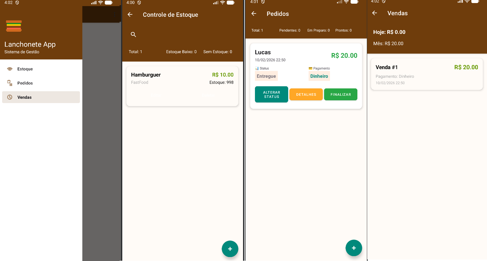

# Aplicativo Android para Lanchonete

Aplicativo Android desenvolvido em Kotlin com Firebase para gerenciamento de pedidos e pesquisa de satisfação de uma lanchonete.

## Imagens do Projeto

### Funcionalidades

- **Gerenciar Produtos** - Adicionar, editar e controlar o estoque de produtos
- **Criar Pedidos** - Criar novos pedidos com múltiplos itens da lanchonete
- **Listar Pedidos** - Visualizar todos os pedidos criados com seus detalhes
- **Finalizar Vendas** - Confirmar e processar pedidos como vendas concluídas
- **Registrar Vendas** - Manter histórico de todas as vendas realizadas
- **Relatório de Vendas** - Visualizar dados consolidados de vendas

